# Отчет по лабораторной работе №6

## Тема
**Лабораторная работа № 6. Хранение и обработка данных в мобильных приложениях**

## Цель работы
Получить навыки работы с разными типами хранилищ Android:
- SharedPreferences
- Jetpack DataStore (Preferences и Proto)
- SQLite (raw SQL)
- Content Provider
- Room

## Выполненные задания 
На основании методических указаний из PDF выполнены проекты по заданиям:
- Задание 1: хранение параметров в SharedPreferences.
- Задание 2: использование Preferences DataStore.
- Задание 3: использование Proto DataStore.
- Задание 4: работа с SQLite через raw-запросы.
- Задание 5: работа с SQLite через Content Provider.
- Задание 6: работа с SQLite через Room.
- Самостоятельные задания 7.1-7.7: адаптация/расширение предыдущих решений (SharedPreferences, Preferences DataStore, Proto DataStore, SQLite raw, обновление схемы, Content Provider с выборками, Room с выборками).

## Краткое описание разработанных проектов
- **Task1**: базовое приложение с SharedPreferences (сохранение пользовательских параметров).
- **Task2**: версия с Preferences DataStore (асинхронная работа через Coroutines/Flow).
- **Task3**: версия с Proto DataStore (типобезопасные структурированные настройки).
- **Task4**: приложение SQLite с raw SQL (создание БД, CRUD, запросы).
- **Task5**: приложение с Content Provider поверх SQLite.
- **Task6**: приложение с Room поверх SQLite.
- **Task71**: самостоятельное 7.1 (SharedPreferences + профиль/авторизация).
- **Task72**: самостоятельное 7.2 (миграция/замена на Preferences DataStore).
- **Task73**: самостоятельное 7.3 (Proto DataStore).
- **Task74**: самостоятельное 7.4 (SQLite raw, операции с таблицей по варианту).
- **Task75**: самостоятельное 7.5 (обновление схемы БД с повышением версии).
- **Task76**: самостоятельное 7.6 (фильтрация, сортировка, группировка, агрегация через Content Provider).
- **Task77**: самостоятельное 7.7 (те же аналитические операции, но через Room).

## Скриншоты выполнения
Ниже приведены скриншоты из каталога docs:

### Задания 1-6
**Task1 (Задание 1, SharedPreferences):** демонстрация запуска приложения и сохранения простых пользовательских настроек в файле общих настроек.
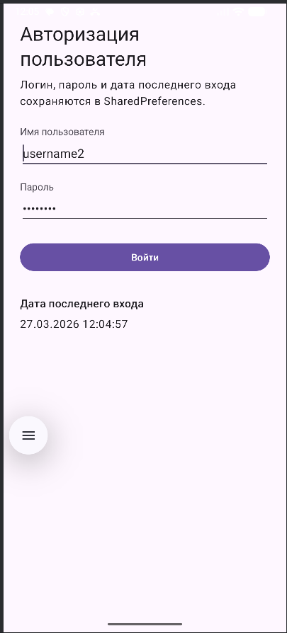

**Task2 (Задание 2, Preferences DataStore):** демонстрация версии приложения, где параметры сохраняются через Preferences DataStore (асинхронно, с Flow/Coroutines).
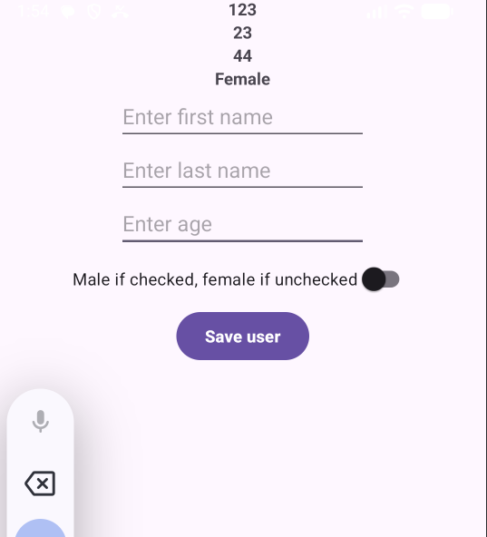

**Task3 (Задание 3, Proto DataStore):** демонстрация хранения структурированных данных настроек в бинарном формате Protocol Buffers.
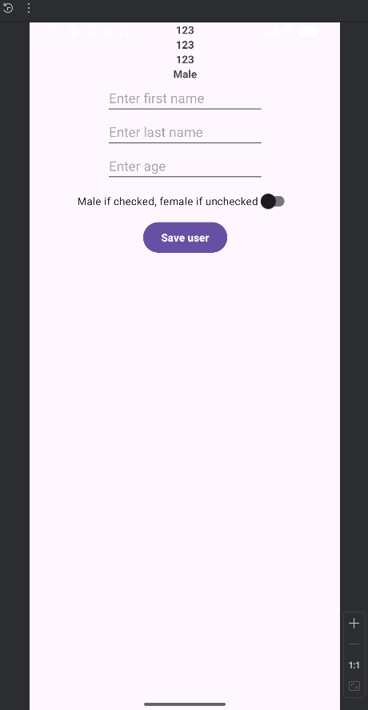

**Task4 (Задание 4, SQLite raw SQL):** демонстрация приложения с созданием/чтением/изменением данных в SQLite через прямые SQL-запросы.
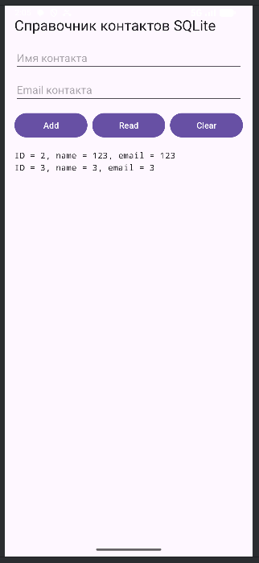

**Task5 (Задание 5, Content Provider):** демонстрация доступа к данным SQLite через слой Content Provider и унифицированные URI-запросы.
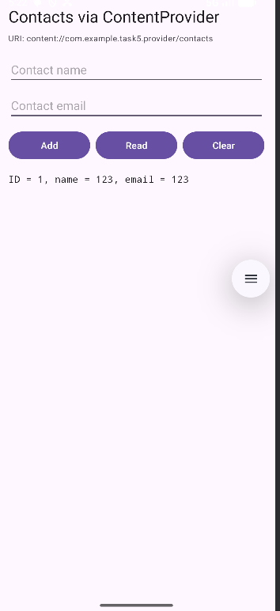

**Task6 (Задание 6, Room):** демонстрация реализации хранения в SQLite через ORM-библиотеку Room (DAO, Entity, Database).
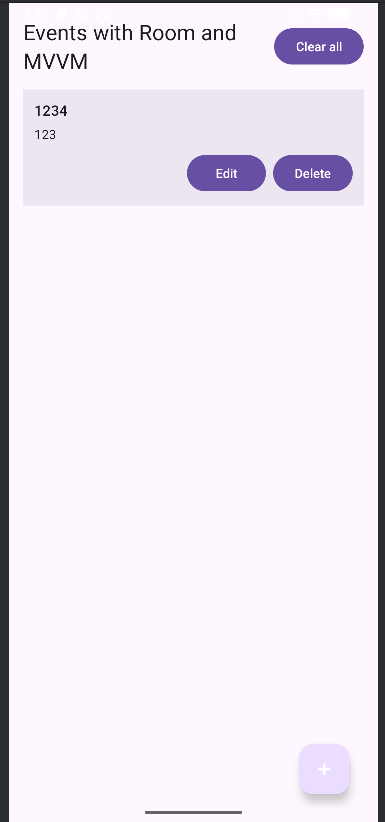

### Задания 7.1-7.7
**Task7.1 (самостоятельное 7.1, SharedPreferences):** запуск модифицированного приложения «Угадай число» с сохранением параметров в двух файлах SharedPreferences.
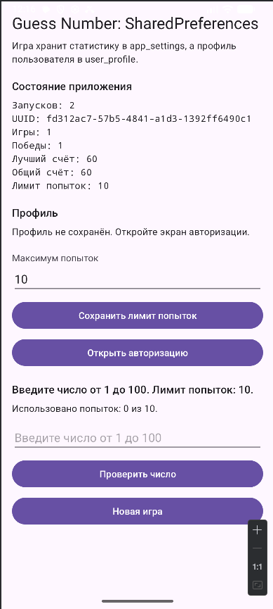

**Task7.1 (экран авторизации):** демонстрация отдельного экрана входа, где email/пароль сохраняются в профильный файл настроек.


**Task7.2 (самостоятельное 7.2, Preferences DataStore):** демонстрация замены SharedPreferences на Preferences DataStore для тех же параметров приложения.
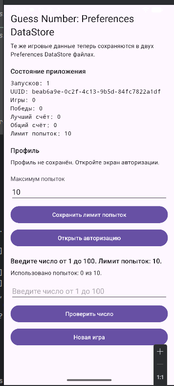

**Task7.3 (самостоятельное 7.3, Proto DataStore):** демонстрация переноса хранения настроек в два файла Proto DataStore (`settings.pb` и `user_profile.pb`).
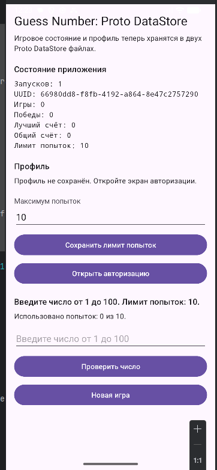

**Task7.4 (самостоятельное 7.4, SQLite raw):** демонстрация вывода всех записей таблицы по варианту задания после инициализации БД и заполнения данными.
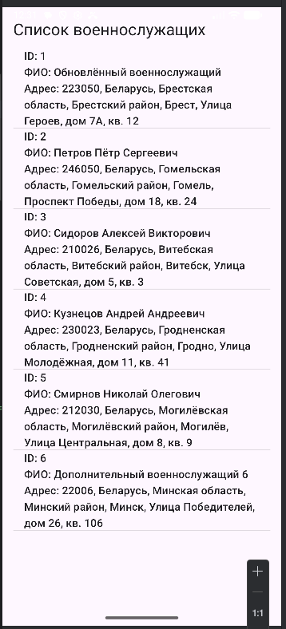

**Task7.4 (главный экран):** демонстрация экрана с основными операциями работы с БД (показ, добавление, изменение записи).
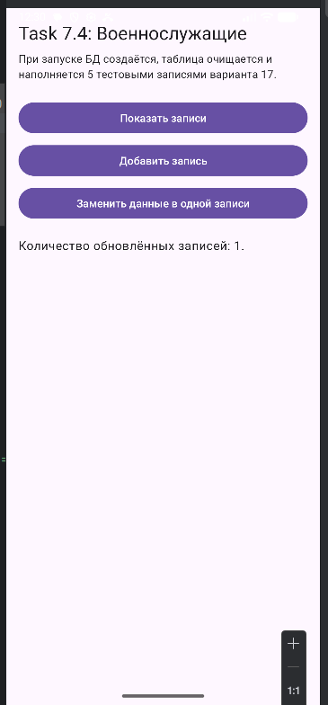

**Task7.5 (самостоятельное 7.5, обновление схемы):** демонстрация работы приложения после повышения версии БД и изменения структуры таблицы с сохранением данных.
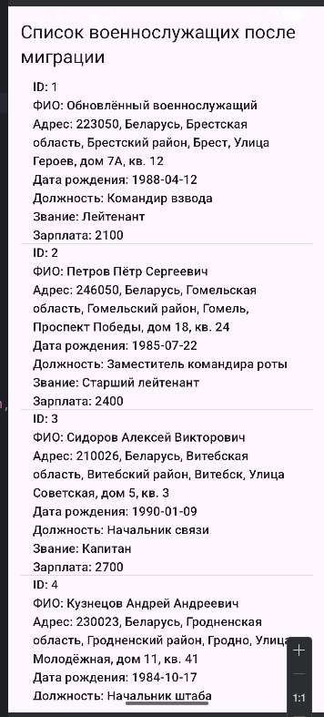

**Task7.6 (самостоятельное 7.6, Content Provider - сортировка):** демонстрация сортировки данных по выбранному полю через запросы к Content Provider.
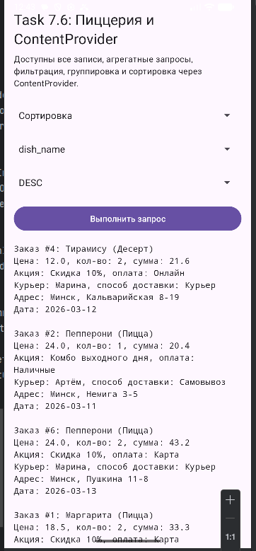

**Task7.6 (Content Provider - фильтрация):** демонстрация выборки строк по условию (значение больше заданного порога).
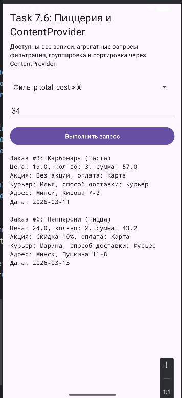

**Task7.6 (Content Provider - группировка):** демонстрация группировки данных и подготовки агрегированных результатов по признаку.
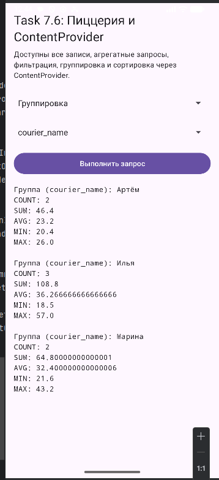

**Task7.7 (самостоятельное 7.7, Room - все записи):** демонстрация экрана вывода всех записей при реализации функционала через Room.
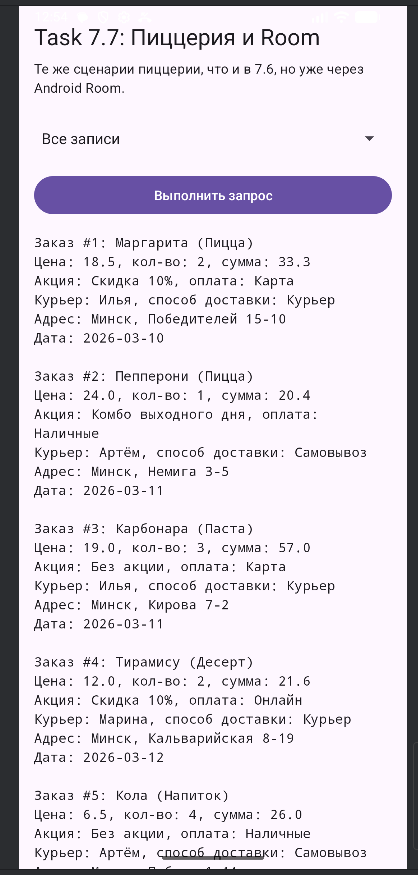

**Task7.7 (Room - агрегирующие функции):** демонстрация вычисления агрегатов (SUM, MIN, MAX, COUNT, AVG) средствами Room/SQL.
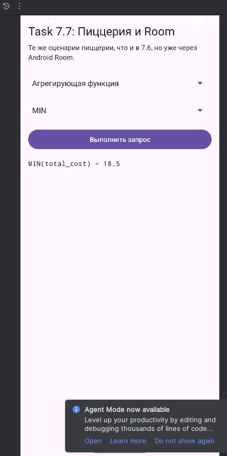

## Ответы на контрольные вопросы

### 1. Какие типы данных можно хранить в SharedPreferences?
- `boolean`
- `float`
- `int`
- `long`
- `String`
- `Set<String>`

### 2. Какой метод используется в случае одного файла общих настроек (SharedPreferences)?
Обычно используют `getPreferences(Context.MODE_PRIVATE)` (файл привязан к конкретной Activity).

### 3. Какой метод используется для нескольких файлов настроек (SharedPreferences)?
Используют `getSharedPreferences(fileName, Context.MODE_PRIVATE)`.

### 4. Какие режимы доступа у SharedPreferences и какой самый надежный?
Актуально использовать `MODE_PRIVATE` (рекомендуемый и самый безопасный режим для обычных приложений).
Исторические режимы `MODE_WORLD_READABLE` и `MODE_WORLD_WRITEABLE` устарели/запрещены из-за рисков безопасности.

### 5. Фрагменты кода: запись, чтение, удаление в SharedPreferences
```kotlin
// Запись
val prefs = getSharedPreferences("app_settings", MODE_PRIVATE)
prefs.edit()
    .putInt("launch_count", 10)
    .putString("user_email", "user@example.com")
    .apply()

// Чтение
val launchCount = prefs.getInt("launch_count", 0)
val email = prefs.getString("user_email", "")

// Удаление одного ключа
prefs.edit().remove("user_email").apply()

// Полная очистка файла
prefs.edit().clear().apply()
```

### 6. Характеристика Preferences DataStore, типы и когда использовать
**Preferences DataStore**:
- асинхронное key-value хранилище;
- работает через `Flow` и корутины;
- потокобезопаснее SharedPreferences;
- предпочтительно для простых пользовательских настроек.

Типы DataStore:
- `Preferences DataStore` (ключ-значение);
- `Proto DataStore` (типобезопасные структурированные данные через protobuf).

Использовать Preferences DataStore рекомендуется для флагов, тем, языка, небольших настроек UI/поведения.

### 7. Фрагменты кода для записи/чтения в Preferences DataStore (ключ-значение)
```kotlin
val Context.appDataStore by preferencesDataStore(name = "app_settings")

object Keys {
    val LAUNCH_COUNT = intPreferencesKey("launch_count")
    val USER_EMAIL = stringPreferencesKey("user_email")
}

// Запись
suspend fun saveLaunchCount(context: Context, value: Int) {
    context.appDataStore.edit { prefs ->
        prefs[Keys.LAUNCH_COUNT] = value
    }
}

// Чтение
val launchCountFlow: Flow<Int> = context.appDataStore.data
    .map { prefs -> prefs[Keys.LAUNCH_COUNT] ?: 0 }
```

### 8. Полный цикл миграции SharedPreferences -> Preferences DataStore
Этапы:
1. Определить имя старого файла SharedPreferences и перечень ключей.
2. Создать DataStore с `SharedPreferencesMigration`.
3. Для каждого ключа обеспечить совпадение типов и дефолтов.
4. Добавить обработку исключений (`IOException`, `ClassCastException`) и логирование.
5. Протестировать миграцию на реальных данных старой версии.
6. После успешной миграции прекратить записи в SharedPreferences.

Потенциальные проблемы и решения:
- Конфликт ключей: использовать префиксы и единый реестр ключей.
- Несовпадение типов: делать безопасное чтение с fallback.
- Частично поврежденный файл: перехватывать исключения, эмитить пустые/дефолтные prefs.
- Дублирование источников правды: после миграции писать только в DataStore.

Пример:
```kotlin
private const val TAG = "SettingsMigration"

val Context.appDataStore by preferencesDataStore(
    name = "app_settings_ds",
    produceMigrations = { ctx ->
        listOf(SharedPreferencesMigration(ctx, "app_settings"))
    }
)

val settingsFlow: Flow<Preferences> = appDataStore.data
    .catch { e ->
        when (e) {
            is IOException -> {
                Log.e(TAG, "I/O error during DataStore read", e)
                emit(emptyPreferences())
            }
            else -> throw e
        }
    }

suspend fun safeWriteLaunchCount(context: Context, value: Int) {
    try {
        context.appDataStore.edit { it[intPreferencesKey("launch_count")] = value }
        Log.i(TAG, "Migration/write success: launch_count=$value")
    } catch (e: Exception) {
        Log.e(TAG, "Migration/write failed", e)
    }
}
```

### 9. Потокобезопасность и consistency: DataStore vs SharedPreferences
- SharedPreferences допускает конкурентные сценарии с риском race condition, особенно при сложных последовательных обновлениях.
- DataStore использует корутины и внутренний single-writer подход: операции `edit` сериализуются, что обеспечивает согласованность.
- DataStore работает в `CoroutineContext` (обычно `Dispatchers.IO` внутри), а чтение идет реактивно через `Flow`.

Проблемы при некорректной миграции:
- потеря ключей;
- неверные типы;
- устаревшие значения из старого источника.

Диагностика:
- журналирование шага миграции;
- интеграционные тесты «до/после»;
- проверка фактических значений в `Flow` после первого запуска.

### 10. Архитектура для нескольких изолированных профилей (Preferences DataStore)
Подход:
- отдельный файл DataStore на профиль: `user_<id>.preferences_pb`;
- в памяти хранить `activeUserId`;
- репозиторий возвращает `Flow` текущего профиля;
- при переключении профиля UI подписывается на новый `Flow` без перезапуска.

Пример:
```kotlin
class ProfileSettingsManager(private val appContext: Context) {
    private val activeUser = MutableStateFlow("default")

    private fun storeFor(userId: String): DataStore<Preferences> {
        return PreferenceDataStoreFactory.create(
            produceFile = { appContext.preferencesDataStoreFile("user_${userId}.preferences_pb") }
        )
    }

    val themeFlow: Flow<String> = activeUser.flatMapLatest { userId ->
        storeFor(userId).data.map { it[stringPreferencesKey("theme")] ?: "system" }
    }

    suspend fun switchUser(userId: String) {
        activeUser.emit(userId)
    }
}
```

### 11. Транзакционная целостность при обновлении нескольких связанных настроек
Для связанных параметров (например, тема и палитра) обновлять их нужно **в одном `edit`**.

```kotlin
suspend fun updateThemeAndPalette(ds: DataStore<Preferences>, theme: String, palette: String) {
    ds.edit { p ->
        p[stringPreferencesKey("theme")] = theme
        p[stringPreferencesKey("palette")] = palette
    }
}
```

Так операция становится атомарной относительно DataStore: не появится состояние, где обновлена только одна часть пары.

### 12. Преимущества Proto DataStore и обратная совместимость схемы
Преимущества:
- типобезопасность (protobuf schema);
- меньше размер файла (бинарный формат);
- быстрый парсинг по сравнению с текстовыми форматами.

Совместимость:
- не менять номера существующих полей;
- новые поля добавлять с новыми номерами;
- удаленные номера/имена помечать `reserved`;
- задавать адекватные значения по умолчанию.

Пример:
```proto
message UserSettings {
  reserved 4, 6;
  reserved "legacy_theme";

  string language = 1;
  bool notifications_enabled = 2;
  int32 font_scale = 3;
  string color_scheme = 5;
}
```

### 13. Система сложных настроек в Proto DataStore (вложенные структуры)
Пример схемы:
```proto
syntax = "proto3";

message QuietHours {
  int32 start_hour = 1;
  int32 end_hour = 2;
}

message CategoryNotification {
  string category = 1;
  bool enabled = 2;
}

message ContentPrefs {
  repeated string preferred_tags = 1;
  bool hide_explicit = 2;
}

message AppProfileSettings {
  repeated CategoryNotification notifications = 1;
  QuietHours quiet_hours = 2;
  ContentPrefs content = 3;
}
```

Сериализатор: класс `Serializer<AppProfileSettings>` с `defaultValue`, `readFrom`, `writeTo`.
Обновление полей без ручной пересборки всех значений делается через `updateData { current -> current.toBuilder().set...().build() }`.

### 14. Класс для создания SQLite и методы жизненного цикла
Используется класс `SQLiteOpenHelper`.
- Если БД не существует: вызывается `onCreate(SQLiteDatabase db)`.
- Если новая версия приложения выше версии БД: вызывается `onUpgrade(SQLiteDatabase db, int oldVersion, int newVersion)`.

Пример:
```kotlin
class DBHelper(ctx: Context) : SQLiteOpenHelper(ctx, "app.db", null, 2) {
    override fun onCreate(db: SQLiteDatabase) {
        db.execSQL("""
            CREATE TABLE items(
                id INTEGER PRIMARY KEY AUTOINCREMENT,
                name TEXT NOT NULL,
                price REAL NOT NULL
            )
        """.trimIndent())
    }

    override fun onUpgrade(db: SQLiteDatabase, oldVersion: Int, newVersion: Int) {
        if (oldVersion < 2) {
            db.execSQL("ALTER TABLE items ADD COLUMN category TEXT DEFAULT 'other'")
        }
    }
}
```

### 15. SQLiteOpenHelper + rawQuery/execSQL: пул соединений и многопоточность
`enableWriteAheadLogging(true)` повышает параллелизм (читатели не блокируются писателем), но:
- запись по-прежнему требует осторожной сериализации;
- долгие транзакции блокируют других писателей;
- при конфликте можно получить `SQLiteDatabaseLockedException`.

Стратегия:
- короткие транзакции;
- retry c backoff для временных блокировок;
- не держать `Cursor` и транзакции дольше нужного;
- использовать один helper и аккуратный доступ из фоновых потоков/диспетчеров.

### 16. Raw SQL: топ-10 артистов по числу треков (avg > 4 мин) + JOIN + фильтр по году
```sql
SELECT ar.id,
       ar.name,
       COUNT(t.id) AS tracks_count,
       AVG(t.duration_sec) AS avg_duration
FROM artists ar
JOIN albums al ON al.artist_id = ar.id
JOIN tracks t ON t.album_id = al.id
WHERE al.release_year >= ?
GROUP BY ar.id, ar.name
HAVING AVG(t.duration_sec) > 240
ORDER BY tracks_count DESC
LIMIT 10;
```

`EXPLAIN QUERY PLAN` должен показать использование индексов в JOIN/WHERE.
Рекомендуемые индексы:
- `CREATE INDEX idx_albums_artist_year ON albums(artist_id, release_year);`
- `CREATE INDEX idx_tracks_album_duration ON tracks(album_id, duration_sec);`
- `CREATE INDEX idx_tracks_album ON tracks(album_id);`

### 17. Пакетная вставка 10 000 записей с максимальной производительностью
Ключевые приемы:
- одна транзакция;
- `SQLiteStatement` + bind;
- `INSERT OR IGNORE`;
- батчирование коммитов при очень больших объемах.

```kotlin
db.beginTransaction()
try {
    val st = db.compileStatement("INSERT OR IGNORE INTO logs(ts, level, msg) VALUES(?, ?, ?)")
    repeat(10_000) { i ->
        st.clearBindings()
        st.bindLong(1, System.currentTimeMillis())
        st.bindString(2, "INFO")
        st.bindString(3, "row_$i")
        st.executeInsert()
    }
    db.setTransactionSuccessful()
} finally {
    db.endTransaction()
}
```

По времени это обычно в разы быстрее одиночных вставок без транзакции.

### 18. ContentProvider.query: CancellationSignal, grantUriPermissions и лимит Binder
- `query(..., CancellationSignal)` должен прерывать долгие операции по сигналу отмены.
- `android:grantUriPermissions="true"` и точечные grant'ы нужны для безопасной передачи URI.
- Риск `rawQuery` в provider: слишком большой результат может упереться в лимит Binder (~1 МБ на транзакцию).

Решение:
- проекции, пагинация (`LIMIT/OFFSET`), фильтрация;
- не передавать тяжелые blob в одном ответе;
- использовать `Cursor` и ленивое чтение.

### 19. Зачем applyBatch + транзакция при синхронизации
Сценарий: синхронизация с сервером присылает пакет insert/update/delete. Если выполнить часть операций и упасть посередине, данные станут несогласованными.

Нужно:
- обернуть весь пакет в транзакцию SQLite;
- при ошибке откатить весь пакет;
- в конце один `notifyChange` по затронутым URI.

Стандартный цикл без явной транзакции потенциально небезопасен, потому что операции могут примениться частично.

### 20. Проектирование Content Provider для обмена данными между приложениями
URI-схема:
- `content://com.example.logs.provider/logs`
- `content://com.example.logs.provider/logs/#`

Разрешения:
- `com.example.logs.permission.READ_LOGS`
- `com.example.logs.permission.WRITE_LOGS`

Методы:
- `query()` - чтение статистики/логов.
- `insert()` - запись новых логов.
- после изменений: `context.contentResolver.notifyChange(uri, null)`.

### 21. Безопасность Content Provider для чувствительных данных
Меры:
- signature-permission для доступа только доверенным приложениям одного разработчика;
- динамическая проверка прав в `call()`/`query()`;
- временные гранты `grantUriPermission()` для конкретного URI и времени жизни.

Пример: выдавать временный read-доступ только выбранному получателю через `Intent.FLAG_GRANT_READ_URI_PERMISSION`.

### 22. Разница @Relation и @Embedded в Room, N+1 проблема
- `@Embedded` встраивает поля объекта в результирующую модель (плоская проекция).
- `@Relation` описывает связи и может порождать дополнительные запросы.

Проблема N+1: при множестве parent-объектов Room может делать отдельные выборки children.
Исправление: писать JOIN-запрос в `@Query`, вернуть DTO с `@Embedded`/`@ColumnInfo`, либо агрегировать на стороне SQL.

### 23. Безопасная миграция Room (добавление таблицы + преобразование данных)
`ALTER TABLE` часто недостаточно, если нужно преобразовать данные (например, `full_name` -> `first_name/last_name`).

Стратегия:
1. Создать новую таблицу нужной схемы.
2. Перенести/трансформировать данные SQL-выражением.
3. Удалить старую таблицу.
4. Переименовать новую.

`fallbackToDestructiveMigration()` опасен в production: удаляет данные при несовпадении схемы.

Тест миграции: использовать `MigrationTestHelper`, создать БД v1, заполнить тестовыми строками, выполнить миграцию к v2, проверить и схему, и данные.

### 24. Когда raw-запросы через SupportSQLiteDatabase быстрее Room
Прирост бывает при:
- очень сложных динамических SQL;
- массовых batch-операциях;
- узких hot-path участках.

Room дает типобезопасность и удобство, но иногда `@RawQuery`/прямой SQL уменьшает overhead и повышает контроль над планом выполнения.
Практика: хранить основную логику в Room, критичные участки оптимизировать точечно raw-запросами.

### 25. Согласованность Room (heavy data) + Proto DataStore (light state)
Стратегия:
- настройки (например, сортировка) хранить в DataStore как `Flow`;
- данные предметной области получать из Room как `Flow`;
- объединять через `combine` в репозитории/ViewModel;
- при изменении данных в Room автоматически обновлять UI по подписке.

Пример:
```kotlin
val sortFlow: Flow<SortMode> = settingsStore.sortModeFlow
val itemsFlow: Flow<List<Item>> = dao.observeAll()

val uiFlow: Flow<List<Item>> = combine(itemsFlow, sortFlow) { items, sortMode ->
    when (sortMode) {
        SortMode.BY_NAME -> items.sortedBy { it.name }
        SortMode.BY_DATE -> items.sortedByDescending { it.createdAt }
    }
}
```

Если удаление записи в Room должно чистить связанный кеш Proto DataStore, это делается в use-case/репозитории в едином сценарии с обработкой ошибок и повторов.

## Вывод
В ходе лабораторной работы №6 отработаны основные механизмы хранения данных Android от простых настроек до реляционной БД и абстракций доступа к данным. На практических заданиях подтверждены навыки:
- выбора подходящего хранилища под задачу;
- миграции и обновления схем;
- построения реактивного доступа к данным;
- реализации фильтрации, сортировки, группировки и агрегации.

