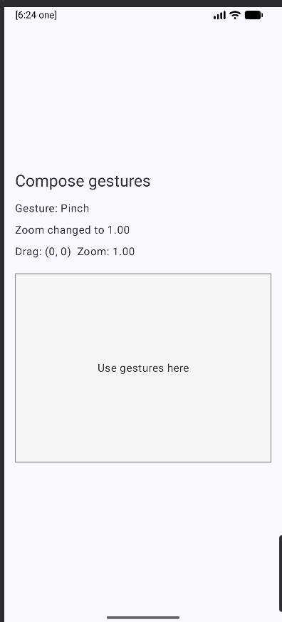
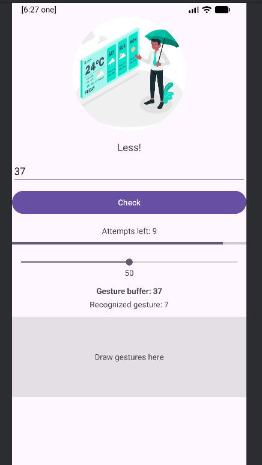
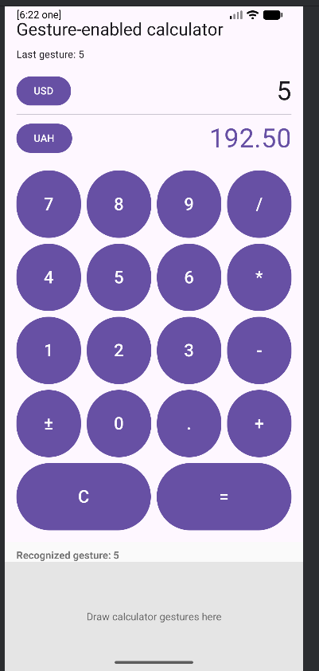
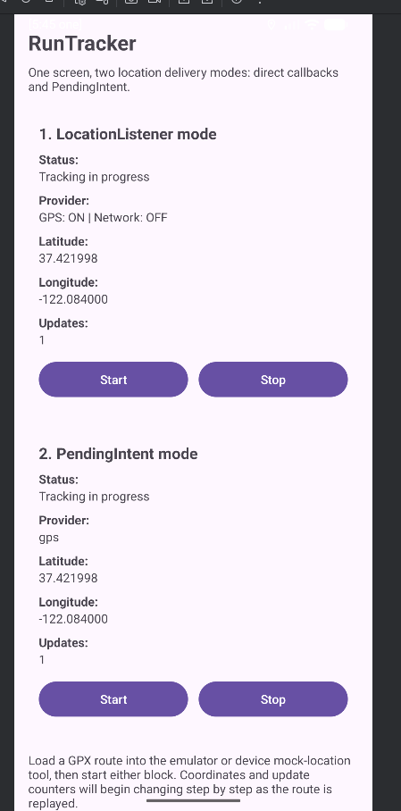
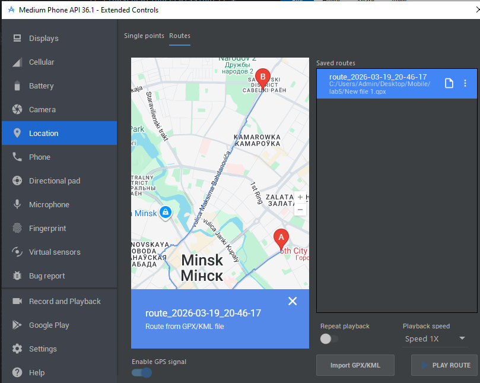
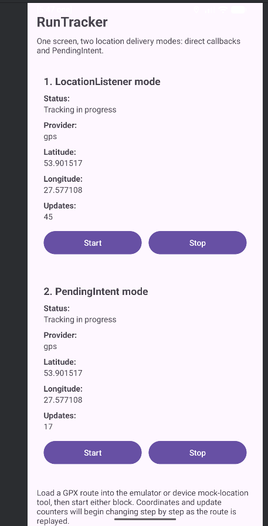
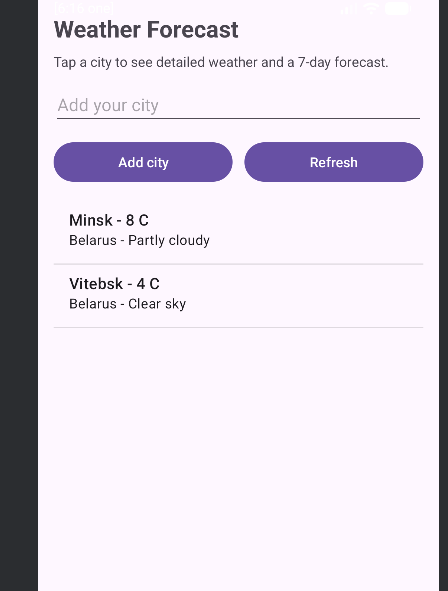
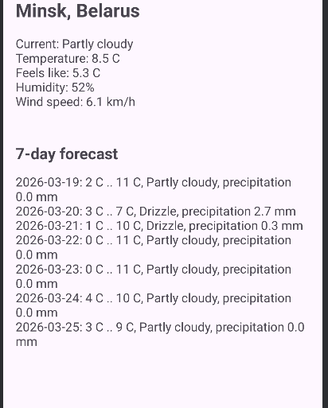
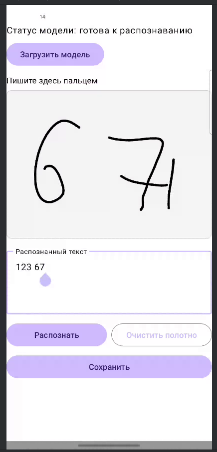

# Отчет по лабораторной работе 5

Автор: Матвей Вержбицкий, 10 группа

## Тема работы

Разработка Android-приложений для работы с жестами, пользовательскими жестами, определением местоположения и получением погодных данных.

## Состав выполненных приложений

1. `DemoActivities`  
   Демонстрация обработки стандартных жестов в Jetpack Compose: нажатие, двойное нажатие, долгое нажатие, перетаскивание и масштабирование.

2. `GuessNumber_Kotlin`  
   Игра "Угадай число" с поддержкой пользовательских жестов. Цифры вводятся жестами, жест `stop` завершает ввод и запускает проверку.

3. `MyCalc`  
   Калькулятор с обычным интерфейсом и дополнительным вводом с помощью кастомных жестов для цифр и операций.

4. `RunTracker`  
   Приложение для отслеживания местоположения. На одном экране показаны два способа получения координат: через `LocationListener` и через `PendingIntent`.

5. `WeatherApplication`  
   Приложение прогноза погоды с предустановленными городами Минск и Витебск, возможностью добавить свой город и открыть детальный прогноз на 7 дней.

6. `Notepad`  
   Одноэкранный блокнот с рукописным вводом. Пользователь пишет пальцем на полотне, после чего приложение распознает рукопись в обычный текст с помощью ML Kit Digital Ink Recognition и сохраняет как штрихи, так и текст заметки.

## Скриншоты

### DemoActivities



### GuessNumber_Kotlin



### MyCalc



### RunTracker







### WeatherApplication





### Notepad



## Краткое описание реализации

### 1. Обработка стандартных жестов

В приложении `DemoActivities` использован Compose-подход к обработке жестов. Для этого применялись модификаторы `pointerInput` и детекторы жестов. Пользователь может нажимать на область, делать двойное нажатие, долгое нажатие, перемещать объект и выполнять масштабирование двумя пальцами.

### 2. Обработка пользовательских жестов

Для `GuessNumber_Kotlin` и `MyCalc` использован бинарный ресурс жестов, подготовленный заранее. В проект добавлен ресурс `res/raw/gestures`, а на экран помещен `GestureOverlayView`, который принимает нарисованные пользователем жесты и передает их на распознавание.

В `GuessNumber_Kotlin` жесты цифр формируют число, а жест `stop` инициирует проверку.  
В `MyCalc` жесты позволяют вводить цифры и операции `+`, `-`, `/`, `x`, `c`, `=`.

### 3. Определение местоположения

В `RunTracker` реализованы два способа получения координат:

1. Через `LocationListener`, когда активность напрямую получает обновления в `onLocationChanged`.
2. Через `PendingIntent`, когда обновления локации приходят в `BroadcastReceiver`, после чего данные сохраняются и отображаются на экране.

Для проверки работы маршрута использовался GPX-файл, который загружался в эмулятор через инструменты геолокации.

### 4. Прогноз погоды

В `WeatherApplication` используется Open-Meteo API.  
Приложение показывает список городов, текущую температуру, краткое описание погоды, а также подробный прогноз на 7 дней для выбранного города.

### 5. Рукописный блокнот и OCR

В `Notepad` реализован простой блокнот с одним экраном. Пользователь пишет пальцем на кастомном полотне `InkCanvasView`, которое собирает точки касания и формирует рукописные штрихи.

Для распознавания рукописи используется библиотека `ML Kit Digital Ink Recognition` с русской моделью `ru`. После нажатия на кнопку распознавания приложение преобразует штрихи в текст и добавляет распознанные слова в текстовое поле, где пользователь может вручную исправить результат.

Состояние заметки сохраняется локально: распознанный текст хранится вместе с сериализованными штрихами. Благодаря этому после повторного запуска приложения восстанавливаются и введенный текст, и рукописное содержимое полотна.

## Контрольные вопросы

1. **Вызов какого метода инициируется при появлении сенсорного события? При каком условии возможна обработка жеста?**

   При появлении сенсорного события вызывается метод `onTouchEvent(MotionEvent event)` или обработчик `onTouch(View v, MotionEvent event)`. Обработка жеста возможна, если событие передается в распознаватель и метод возвращает `true`, то есть событие считается обработанным.

2. **Какой класс позволяет распознавать стандартные жесты без обработки отдельных сенсорных событий?**

   Класс `GestureDetector` или его совместимая версия `GestureDetectorCompat`.

3. **Перечислите методы, отвечающие за прослушивание сенсорных событий.**

   Основные методы: `onTouchEvent()`, `onInterceptTouchEvent()`, `setOnTouchListener()`, а также методы интерфейсов `OnGestureListener` и `OnDoubleTapListener`, например `onDown()`, `onSingleTapUp()`, `onSingleTapConfirmed()`, `onDoubleTap()`, `onLongPress()`, `onScroll()`, `onFling()`.

4. **С помощью какого приложения можно создавать свои жесты и добавлять их в виде бинарного ресурса в свое приложение?**

   Для этого используется приложение `Gesture Builder`.

5. **Какой элемент требуется добавить в XML-файл активности для распознавания созданных жестов? Какие способы его добавления?**

   Нужно добавить `GestureOverlayView`. Его можно:
   - добавить прямо в XML-разметку;
   - создать программно в коде и добавить в иерархию `View`.

6. **Какой интерфейс должен реализовывать класс активности при обработке созданных жестов?**

   `GestureOverlayView.OnGesturePerformedListener`.

7. **Какой интерфейс используется для получения уведомлений от LocationManager, когда местоположение изменилось?**

   `LocationListener`.

8. **Как расшифровывается аббревиатура NMEA? И для чего применяется?**

   `NMEA` — `National Marine Electronics Association`. Формат предложений NMEA применяется для передачи данных навигации и GPS/GNSS: координат, скорости, высоты, времени, спутниковой информации.

9. **Как расшифровывается аббревиатура GNSS?**

   `Global Navigation Satellite System`.

10. **Расшифруйте аббревиатуры GPX, KML. Для каких задач применяются файлы формата GPX и KML? Приведите примеры файлов формата GPX и KML.**

   `GPX` — `GPS Exchange Format`.  
   `KML` — `Keyhole Markup Language`.

   `GPX` используется для хранения GPS-треков, маршрутов, точек пути.  
   `KML` используется для представления геоданных, маршрутов, областей и подписей на картах.

   Примеры:
   - GPX-файл с маршрутом пробежки или поездки;
   - KML-файл с набором точек на карте Google Earth или маршрутом экскурсии.

11. **Когда рекомендуется применять PendingAPI вместо LocationManager?**

   Подход с `PendingIntent` рекомендуется применять, когда обновления местоположения должны приходить не только в момент активного отображения экрана, а асинхронно, через систему, например для фоновой обработки или доставки данных в `BroadcastReceiver`/`Service`.

12. **Как называется класс данных, использующийся для представления географического местоположения?**

   `Location`.

13. **Какими данными описывается местоположение?**

   Обычно местоположение описывается широтой, долготой, высотой, временем фиксации, точностью, скоростью, направлением движения и поставщиком данных.

14. **Какие строки необходимо добавить в AndroidManifest.xml, чтобы приложение для определения местоположения получило доступ к Интернет?**

   Нужно добавить:

   ```xml
   <uses-permission android:name="android.permission.INTERNET" />
   <uses-permission android:name="android.permission.ACCESS_NETWORK_STATE" />
   ```

15. **Какие концепции реализации многопоточности в Android можем использовать?**

   Можно использовать:
   - `Thread`;
   - `Runnable`;
   - `ExecutorService`;
   - `Handler` и `Looper`;
   - `Coroutine` в Kotlin;
   - `WorkManager`;
   - `Service` и `IntentService` в старых подходах;
   - реактивные библиотеки, например `RxJava`.

16. **Для каких основных компонент может применяться асинхронная обработка и многопоточность и с помощью каких подходов?**

   Асинхронная обработка применяется для:
   - `Activity` и `Fragment` — например, через `Coroutine`, `lifecycleScope`, `Handler`, `Executor`;
   - `Service` — через фоновые потоки, `Coroutine`, `WorkManager`;
   - `BroadcastReceiver` — для короткой асинхронной обработки, иногда через запуск `WorkManager` или `Service`;
   - сетевого взаимодействия — через `Coroutine`, `Retrofit`, `OkHttp`, `ExecutorService`;
   - работы с базой данных — через `Room`, `Coroutine`, `Flow`, `LiveData`;
   - фоновых задач — через `WorkManager`.
